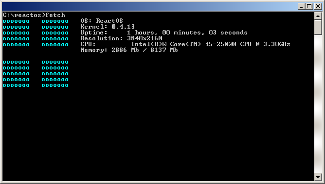

# ROS_Fetch

Fetch is a utility for displaying information on the [ReactOS](https://github.com/reactos) command line. 

Fetch is written for integration into the command line (cmd.exe) ReactOS. The utility is written in C and uses only the standard WinAPI libraries.

The Fetch for ReactOS approach is similar to that of the [screenfetch](https://github.com/KittyKatt/screenFetch) and [neofetch](https://github.com/dylanaraps/neofetch) utilities. Fetch displays the ASCII logo of the OS on the left, and displays information about the system on the right.

